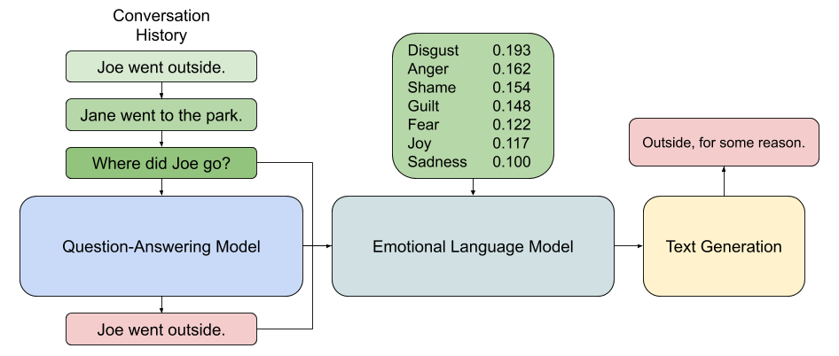
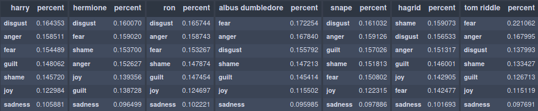
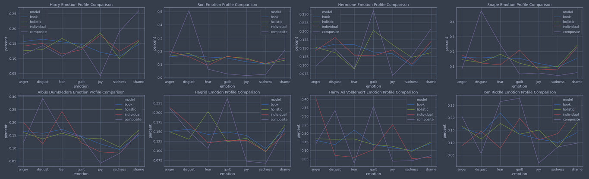
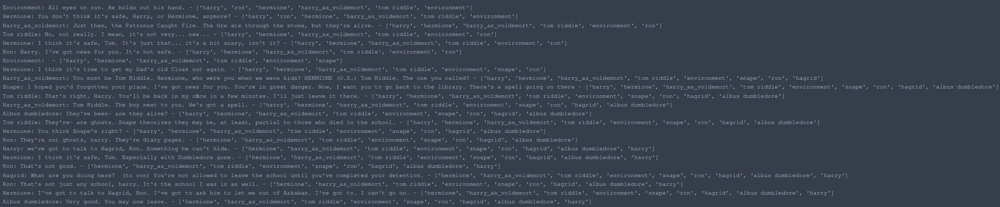
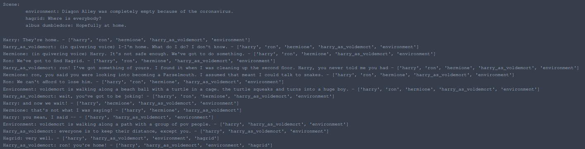
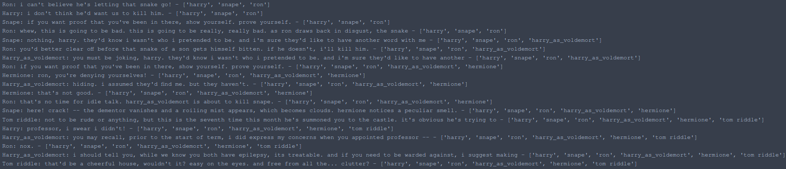

# Lucid Dream
[](https://zenodo.org/badge/latestdoi/189282514)

Dynamic Story Generation through directed chatbot interactions.


# Summary
This repository contains exploratory efforts towards controlling text generation using the GPT-2 model in a chatbot environment. It also houses an experimental Discord bot for interacting with simplified trained models.

## Dynamically Generating Stories
The `notebooks/Lucid Dream.ipynb` is the main notebook that aggregates the exploratory efforts from the others and provides the `start_conversation` function, which allows for a scene to by dynamically created and modified. For the purpose of this study, a corpus was created primarily composed of the first three Harry Potter movie scripts and used to train subsequent models. Text generation was done using fine-tuned GPT-2 models and followed the architecture below.



Three methods of text generation were explored:
- Composite Emotion Modeling
    - GPT-2 models were trained for each emotion in the ISEAR dataset and were composited together based on the target percent breakdowns of each character to generate a response.
- Individual Character Modeling
    - The Harry Potter corpus was divided into sub-corpora for each character based on whether the character was present in the scene (determined by if they had talked within the last *n* interactions) and a GPT-2 model was fine-tuned on each respectively. This was done to limit knowledge to only what the character should've had access to.
- Holistic Modeling
    - A GPT-2 model was fine-tuned on the entire Harry Potter corpus and an instance of this was used per character to generate a response.

In each of the above methods, the GPT-2 models had their response seeded with the conversation history, a question-answering model suggested response, and the list of characters present in the scene. Then, the target character's name was provided to force a response.

## Question-Answering
Multiple methods of question-answering were explored, but in the end, a simple approach using a fastText language model and cosine similarity was decided upon. While this wasn't expected to produce SOTA results, it had an accuracy of 65.24% at predicting the sentence containing the answer to a contextual question on the development subset of the Stanford Question-Answering Dataset.

## Emotion Detection

Emotion classification was attempted on the International Survey on Antecdents and Reactions (ISEAR) dataset using naive bayes, log regression, and support vector machine models. While the SVM model was shown to have the best accuracy (57.3%), the log regression method was chosen as this provided a categorical class breakdown for each prediction and could be used to perform emotional style transfers.


When the log regression model was applied to some of the main Harry Potter characters in the corpus, the emotional breakdowns below were produced.



Comparing the above profiles against output that was generated by fine-tuned GPT-2 models meant to either emulate the entire character or just the emotional profile of the character produced the graphs below.



## Examples

Each generation method used a model or series of models created by fine-tuning the base 355M GPT-2 model.

### Harry Potter: Hermione in Azkaban


### Harry Potter: Voldemort and the Beach Ball Turtles


### Harry Potter: The Snake of a Son


## Discord Bot
The Discord Bot located in `discord_bot/bot.py` serves as an interface for the gpt-2-simple library and aims to replicate some of the techniques used in the Lucid Dream notebook. It additionally includes some commands tailored specifically for the Discord environment. The bot is also structured in such a way that it can freely call upon commands itself. The following commands are available to use the bot:
```
!help:
    !save <no args>: save the current chat history to a local file on the server.
    !breakdown <exact name>: gives an emotional breakdown of the user based on their past conversation.
    !users <no args>: returns a list of users and aliases for users that, if mentioned, will trigger the bot. Format: alias:username
    !add <alias:username>: Adds an alias/username as a trigger word for the bot. passing one argument is equivalent to saying username:username (ex. !add user == !add user:user).
    !remove <alias>: Removes an alias as a trigger word for the bot.
    !label <emotion>: Label the past message sent as a certain emotion (doesn't have to be a bot's last message). This helps the model learn emotions better and get better profiles.
    !models <no args>: Show a list of available models to switch the chatbot to.
    !useModel <model_name>: Switch the chatbot to use the model specified.
    !shutup <no args>: If the model manages to say "!free", it will no longer be bound to waiting for trigger words to respond and will be able to talk freely. !shutup will end this.
    !temperature <optional temperature>**: Either see the current temperature level or set a new one.
    !trumpOrAI <no args>: Try to guess whether the next message was sent by trump or an AI. Game ends when someone guesses trump or AI correctly.
```

# Cite
```
@software{ryan_stonebraker_2020_3762840,
  author       = {Ryan Stonebraker},
  title        = {{Dynamic Story Generation through Directed Chatbot Interactions}},
  month        = {4},
  year         = {2020},
  publisher    = {Zenodo},
  version      = {v0.1.0},
  doi          = {10.5281/zenodo.3762840},
  url          = {https://doi.org/10.5281/zenodo.3762840}
}
```
